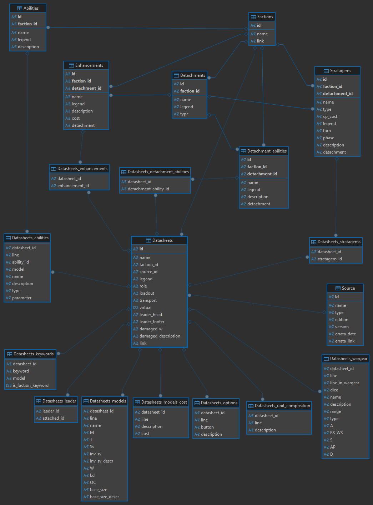

# warhammer_sim

## Load data
To simplify use of wahapedia data we load them in a sqlite file. This is done by the `data_load/load_wahapedia_data.py` python file. The file data scheme folows the file structure presented in [this spec file](http://wahapedia.ru/wh40k10ed/Export%20Data%20Specs.xlsx) (at this time 2026-05-02) where each csv file is represented as a table.

### Powered by Wahapedia
Models data are imports from wahapedia, see http://wahapedia.ru/wh40k10ed/the-rules/data-export